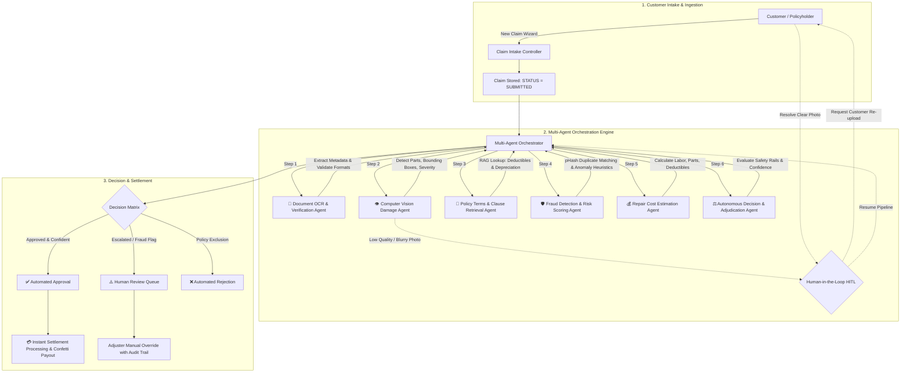

# ClaimX: Autonomous Multi-Agent Insurance Claims Orchestration & Settlement Engine

[](https://react.dev/)
[](https://www.typescriptlang.org/)
[](https://vitejs.dev/)
[](https://tailwindcss.com/)
[](https://expressjs.com/)
[](LICENSE)
  
> **Akarshana S**, **Gopika A S**, **Neha S**

---

## 📌 Overview

**ClaimX** is a full-stack, autonomous multi-agent claims adjudication and settlement platform designed to modernize traditional insurance claim pipelines. Built as a high-performance monorepo, ClaimX automates end-to-end claim lifecycles—from intake document verification and visual damage inspection to policy RAG clause retrieval, fraud scoring, and instant payment settlement.

Traditional insurance workflows take 5–14 business days, depend on manual paperwork reviews, and suffer from high operational costs and fraud leakage. ClaimX shifts this paradigm by enabling **Straight-Through Processing (STP)** for verified, low-risk claims within seconds, while autonomously detecting anomalies and routing complex edge cases to a **Human-in-the-Loop (HITL)** adjuster dashboard.

---

## 🏗️ Architecture & Multi-Agent Pipeline

ClaimX divides complex claim adjudication across **7 Specialized Autonomous AI Agents** coordinated by a central Orchestrator:



---

## 🤖 The 7 Autonomous Agents

1. **Multi-Agent Orchestrator (`orchestrator`)**: Coordinates execution state, routes tasks between agent workers, checks confidence thresholds, handles pause/resume lifecycles, and commits immutable audit trails.
2. **Document Verification & OCR Agent (`document`)**: Performs automated optical character recognition on uploaded driving licenses, insurance policy schedules, and repair invoices. Validates names, IDs, dates, and vehicle registration numbers.
3. **Vision Damage Assessment Agent (`vision`)**: Uses computer vision bounding box models to locate vehicular damage (e.g. bumper cracks, dented panels, broken headlights). Computes confidence scores and triggers customer clarification requests if images are blurry or underexposed.
4. **Policy Clause & Retrieval Agent (`policy`)**: Employs semantic search and Retrieval-Augmented Generation (RAG) to locate relevant clauses in policy schedules, identifying depreciation schedules (e.g. 50% on plastic/rubber) and compulsory deductibles.
5. **Fraud Detection & Risk Scoring Agent (`fraud`)**: Uses 64-bit perceptual difference hashing (dHash) to flag re-submitted or duplicate historical photos. Evaluates fraud heuristics, including policies purchased $<15$ days prior and suspiciously rounded estimate values.
6. **Cost Estimation Agent (`estimation`)**: Calculates total itemized repair costs by cross-referencing OEM parts catalogs, labor rates, and policy deductibles.
7. **Adjudication & Safety Agent (`decision`)**: Synthesizes findings across all dimensions. Applies hard safety ceiling overrides ($>\text{INR } 50,000$) and low-confidence thresholds to enforce risk containment.

---

## 💻 Feature Highlights & Portals

### 1. Dual-Persona Role-Based Split Login
- **Customer Portal**: For policyholders to file claims, upload evidence, track live progress in real-time, and view settlement receipts.
- **Adjuster / Executive Command Center**: For claim handlers, managers, and risk auditors.

### 2. Executive Command Center
- **Key Performance Indicators (KPIs)**: Straight-Through Processing (STP) rate, average turnaround time, active volume, and total settled payouts.
- **Pipeline Funnel**: Visual representation of claim distribution from intake to completed settlement.
- **Live Activity Feed**: Real-time ticker of multi-agent activities, approvals, and anomaly flags.
- **Interactive Claims Table**: Comprehensive search, filter by risk/status, and quick-action view.

### 3. Live Agent Orchestrator View
- Real-time step-by-step agent execution tracker with animated processing status.
- Live confidence meters per agent with visual progress bars.
- Live terminal execution logs with timestamps and agent identity tags.
- Interactive **Human-in-the-Loop Resolver**: simulates uploading a clear replacement image to unpause and resume the agentic pipeline.

### 4. Human Review & Audit Workspace
- Side-by-side evidence inspection: original accident photos, extracted document fields, and policy citations.
- Fraud risk breakdown with itemized warning flags.
- Manual Adjuster Review actions: **Approve Claim**, **Reject Claim**, or **Request Additional Evidence** with mandatory notes.

### 5. Analytics & AI Performance Hub
- STP efficiency benchmarks vs. manual industry averages.
- Visual breakdown of claim distribution by risk tier, claim amounts, and vehicle damage categories using Recharts.
- Historical cycle time reduction analytics.

### 6. Digital Payment Settlement
- Integrated payment processing simulator supporting instant bank transfer, UPI, and digital wallet disbursements.
- Dynamic celebration animations via Canvas Confetti upon successful claim settlement.

---

## 📂 Repository Structure

```text
ClaimFlow/
├── backend/                             # Express & TypeScript REST API
│   ├── src/
│   │   ├── controllers/
│   │   │   ├── claimsController.ts      # Claims CRUD & settlement handlers
│   │   │   └── orchestratorController.ts# Multi-agent loop execution & HITL
│   │   ├── routes/
│   │   │   ├── claimsRoutes.ts          # /api/claims endpoints
│   │   │   └── orchestratorRoutes.ts    # /api/orchestrator endpoints
│   │   ├── services/
│   │   │   ├── claimsEngine.ts          # Core state operations
│   │   │   ├── mockData.ts              # Pre-seeded test claims & scenarios
│   │   │   └── orchestratorEngine.ts    # Multi-agent worker logic & timers
│   │   ├── types/
│   │   │   └── claims.ts                # TypeScript domain models & interfaces
│   │   └── server.ts                    # Express server entry point & CORS
│   ├── package.json
│   └── tsconfig.json
├── frontend/                            # React 18, Vite & Tailwind CSS Client
│   ├── src/
│   │   ├── components/
│   │   │   ├── layout/                  # Sidebar, Topbar navigation
│   │   │   └── ui/                      # KPI cards, Badges, Modals, Toasts
│   │   ├── features/
│   │   │   ├── analytics/               # STP rate charts & AI performance
│   │   │   ├── auth/                    # Role-based split login view
│   │   │   ├── claim-details/           # Full claim audit & evidence viewer
│   │   │   ├── claim-intake/            # Multi-step claim submission wizard
│   │   │   ├── command-center/          # Executive dashboard & funnel
│   │   │   ├── customer-portal/         # Customer dashboard & tracking view
│   │   │   ├── human-review/            # Adjuster review queue & overrides
│   │   │   ├── live-orchestrator/       # Interactive live agent execution
│   │   │   └── settlement/              # Payment settlement & payout simulator
│   │   ├── services/                    # API clients (claims, notifications)
│   │   ├── types/                       # Shared frontend TypeScript interfaces
│   │   ├── App.tsx                      # View router & global notification state
│   │   ├── index.css                    # Tailwind directives & design tokens
│   │   └── main.tsx                     # React root mount
│   ├── package.json
│   ├── tailwind.config.js
│   └── vite.config.ts
├── package.json                         # Monorepo root scripts
└── README.md                            # Project documentation
```

---

## 🛠️ Setup & Running Locally

### 1. Prerequisites
- **Node.js** (v18.0.0 or higher recommended)
- **npm** (v9.0.0 or higher)

### 2. Installation
Clone the repository and install dependencies across both frontend and backend using the monorepo script:

```bash
# 1. Clone the repository
git clone https://github.com/GopikaArumugam/ClaimX.git
cd ClaimX

# 2. Install all dependencies for root, frontend, and backend
npm run install:all
```

### 3. Launch Development Servers
Run both the Express backend and Vite frontend concurrently with a single command:

```bash
npm run dev
```

The console will launch:
- 🌐 **Frontend Application**: [http://localhost:5173](http://localhost:5173)
- ⚙️ **Backend API Server**: [http://localhost:5000](http://localhost:5000)
- 🩺 **API Health Check**: [http://localhost:5000/api/health](http://localhost:5000/api/health)

---

## 📡 REST API Reference

### Claims Endpoints (`/api/claims`)
| Method | Endpoint | Description |
| :--- | :--- | :--- |
| `GET` | `/api/claims` | List all claims (supports filtering by status & risk) |
| `GET` | `/api/claims/kpis` | Aggregate metrics (STP rate, total claims, pending reviews) |
| `GET` | `/api/claims/:id` | Get full claim object with agent audit results |
| `POST` | `/api/claims` | Submit a new claim from the intake wizard |
| `PUT` | `/api/claims/:id` | Update claim details |
| `POST` | `/api/claims/:id/adjudicate` | Publish manual adjuster decision (Approve/Reject with comments) |
| `POST` | `/api/claims/:id/settle` | Execute payment disbursement and mark as PAID |
| `POST` | `/api/claims/reset` | Reset demo state back to default pre-seeded claims |

### Orchestrator Endpoints (`/api/orchestrator`)
| Method | Endpoint | Description |
| :--- | :--- | :--- |
| `POST` | `/api/orchestrator/:id/run` | Triggers the 7-agent automated execution pipeline |
| `POST` | `/api/orchestrator/:id/resolve-photo` | Injects clear photo and unpauses pipeline (HITL resolution) |

---

## 🧪 Testing the Live Multi-Agent Workflow

1. Navigate to **[http://localhost:5173](http://localhost:5173)** and sign in via the **Customer** or **Claims Adjuster** portal.
2. Under the **Command Center**, click on any claim with `SUBMITTED` or `DRAFT` status (e.g., `CLM-2024-002`).
3. Click **"Run Orchestration"**:
   - Watch the 7 agents light up sequentially on the **Live Orchestrator View**.
   - Inspect the real-time terminal output and confidence meters.
4. For edge-case claims (e.g. blurry damage photos):
   - Notice the system pause with status `AWAITING_CUSTOMER`.
   - Click **"Upload Clear Photo (Simulate)"** to watch the orchestrator autonomously resume, complete assessment, and transition the claim to approval!

---

## 👥 Authors & Contributions

Developed by:
- **Akarshana S**
- **Gopika A S**
- **Neha S**

---

## 📄 License
This project is licensed under the [MIT License](LICENSE).
